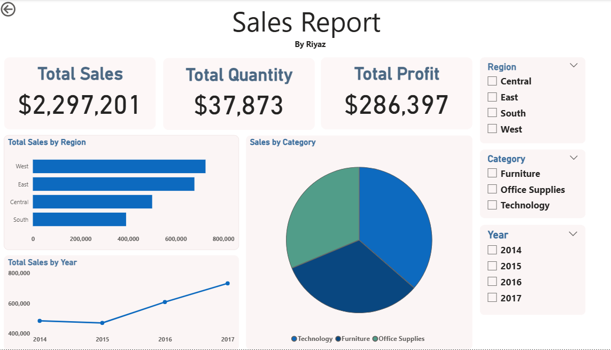

# 📊 Power BI Sales Dashboard – Superstore Dataset

### 🧾 Project Overview
The **Power BI Sales Dashboard** is an interactive business intelligence report designed to visualize and analyze sales performance across various regions, product categories, and time periods.  
The goal was to extract meaningful insights that can help management make data-driven decisions regarding profitability, customer trends, and growth opportunities.

---

### 🎯 Objective
To analyze and visualize the **Superstore Sales Data** by:
- Evaluating total sales, profit, and quantity sold  
- Comparing regional and category-wise performance  
- Identifying top-performing products  
- Observing monthly and yearly sales trends  

---

### 🧰 Tools & Technologies
| Tool | Purpose |
|------|----------|
| **Power BI Desktop** | Data cleaning, modeling, and visualization |
| **Power Query Editor** | Data transformation and preprocessing |
| **DAX (Data Analysis Expressions)** | Calculations and KPIs |
| **Kaggle Dataset** | Real-world business data source |

---

### 📂 Dataset Details
**Source:** [Superstore Dataset – Kaggle](https://www.kaggle.com/datasets/vivek468/superstore-dataset-final)  
**Records:** ~10,000+  
**Columns Include:**

Order ID | Order Date | Ship Date | Customer Name | Segment | Country | Region | State |
Category | Sub-Category | Product Name | Sales | Quantity | Discount | Profit


---

### 🧹 Data Cleaning & Preparation (Power Query)
As a data analyst, I began by performing a **structured data cleaning process** inside Power BI’s Power Query Editor:

#### 🔧 Steps Taken:
1. **Loaded raw data** from the CSV file into Power BI.  
2. **Checked for missing or null values** in key fields (Sales, Profit, Order Date).  
3. **Removed duplicate records** using *Remove Duplicates* option.  
4. **Changed data types** for correct interpretation (e.g., Dates, Currency).  
5. **Extracted Month & Year** columns from the Order Date for trend analysis.  
6. **Renamed columns** for better readability and standardization.  
7. Verified categorical fields such as *Region, Category, and Sub-Category* for consistent values.  

This ensured that the dataset was **clean, accurate, and ready for data modeling.**

---

---

demo:


---

### 🧠 Data Modeling (Star Schema)
Created a simple **Star Schema** with:
- **Fact Table:** Sales transactions  
- **Dimension Tables:** Regions, Products, Dates  

Relationships were built on:


Date[Date] → Sales[Order Date]
Product[Product ID] → Sales[Product ID]
Region[Region Name] → Sales[Region]


This helped in building flexible, filterable visualizations using slicers.

---

### 🧮 DAX Measures Created
To calculate key performance indicators (KPIs), I used the following **DAX formulas**:

```DAX
Total Sales = SUM(Sales[Sales])
Total Profit = SUM(Sales[Profit])
Total Quantity = SUM(Sales[Quantity])
Profit Margin (%) = DIVIDE([Total Profit], [Total Sales], 0)

📈 Dashboard Features

The final Power BI dashboard contains interactive and clean visual elements to represent the data effectively.

🧾 KPI Cards

💰 Total Sales

📦 Total Quantity Sold

💹 Total Profit

📊 Profit Margin (%)

📊 Visuals Used
Visualization	Purpose
Bar Chart	Sales by Region
Pie Chart	Sales by Category
Line Chart	Monthly Sales Trend
Bar Chart	Top 10 Products by Sales
Cards	KPIs Overview
Slicers	Region, Category, Year filters
🧭 Interactivity


All visuals are connected through slicers, allowing users to filter data dynamically and drill down into details like region-specific or year-wise trends.

💡 Key Insights

Based on my analysis in Power BI:

West Region generated the highest total sales and profit.

Technology Category contributes the most to profit margins.

November and December are peak months for sales, indicating strong holiday demand.

Office Supplies have steady sales but lower profit margins due to discounts.

Certain sub-categories like Copiers and Phones drive the most revenue overall.

🧩 Project Structure
📁 PowerBI-Sales-Dashboard/
│
├── 📄 README.md                     # Project Documentation
├── 📈 PowerBI_Sales_Dashboard.pbix  # Power BI Project File
├── 📄 Superstore_Data.csv           # Original Dataset
└── 🖼️ Dashboard_Reference.png       # Dashboard Preview Image

📸 Dashboard Preview

🚀 How to Use

Download the .pbix file and dataset from this repository.

Open the file in Power BI Desktop (latest version recommended).

Click on slicers to filter data by Region, Category, or Year.

Explore the charts to uncover insights interactively.

🔮 Future Enhancements

Add Forecasting visuals for sales trends.

Integrate Profit by Customer Segment visual.

Automate data refresh using Power BI Service.

Add dynamic tooltips with additional DAX measures.

👨‍💻 Author

Shaik Riyaz
💼 Data Analyst | Power BI | SQL | Python | Machine Learning
📧 shaikriyaz1574@gmail.com | 🌐 linkedin.com/riyaz52
